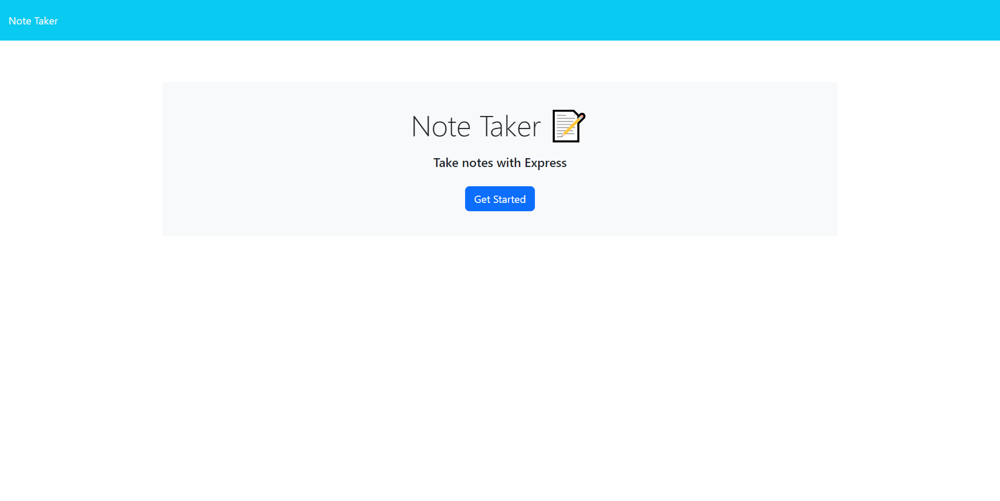

# Note Taker App
The Note Taker App is a simple web application that allows small business owners to write and save notes. It helps users organize their thoughts, keep track of tasks, and manage their important notes in one place.

https://lit-caverns-89137-c93ae5eceb7d.herokuapp.com/
 

## Features
Landing Page: The app presents a landing page with a link to the notes page.
Notes Page: On the notes page, users can see a list of existing notes in the left-hand column, and empty fields to enter a new note title and the note's text in the right-hand column.
Save Note: When users enter a new note title and note text, a Save icon appears in the navigation at the top of the page. Clicking on the Save icon saves the new note, and it appears in the left-hand column with the other existing notes.
View Note: Users can click on an existing note in the list to view the note in the right-hand column.
Write New Note: Clicking on the Write icon in the navigation at the top of the page presents empty fields to enter a new note title and note text in the right-hand column.
Data Storage: The application uses a db.json file on the back end to store and retrieve notes using the fs module.

## Getting Started
To run the Note Taker App on your local machine, follow these steps:

Clone this repository to your local machine.

Navigate to the project directory in your terminal or command prompt.

Install the dependencies using npm:

bash
Copy code
npm install
Start the application:

bash
Copy code
npm start
Open your web browser and go to http://localhost:3000 to access the Note Taker App.

## API Routes
The Note Taker App includes the following API routes:

GET /api/notes: This route reads the db.json file and returns all saved notes as JSON.
POST /api/notes: This route receives a new note to save in the request body, adds it to the db.json file, and returns the new note to the client. Each note is given a unique ID when saved.
DELETE /api/notes/:id: This route deletes the note with the specified ID from the db.json file.

## Dependencies
The Note Taker App uses the following dependencies:

Express.js: A web application framework for Node.js.
UUID: A package used to generate unique IDs for each note.

## Contributing
Contributions to the Note Taker App are welcome! If you find any bugs or have suggestions for improvements, please open an issue or submit a pull request.
Feel free to customize this README according to your app's specific details and requirements. You can also add installation instructions, deployment guides, and other relevant information to make it more comprehensive.

## License
The Note Taker App is open-source and distributed under the MIT License.
